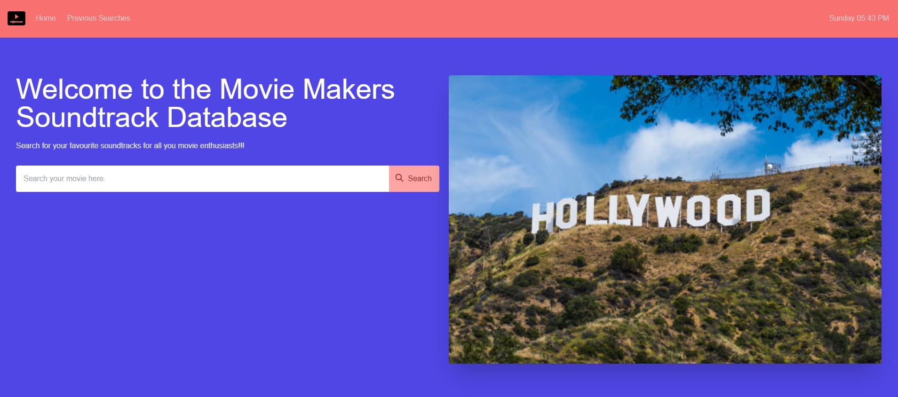

# Movie Makers Soundtrack Database

## Description

Welcome to the Movie Makers Soundtrack Database, The purpose of this site is for users to search for the music soundtracks of movies they have love or have watched or have an interest for. This was a project that was not made by 1 individual but a collaboration of 3 individuals who were studying a bootcamp of coding. This was our first ever team project in the world of IT and finding the balance of our everyday lives and working as a team in IT, lots of learning. It was a great experience, challenging and very rewarding as we have only been coding for 8 weeks.

## Table of Contents

- [Installation](#installation)
- [Usage](#usage)
- [Technology](#Technology)
- [Credits](#credits)
- [License](#license)

## Installation

This site may be accessed 

## Usage
- Main Page

## Technology

- DayJS
- Tailwind (CSS)
- HTML
- Javascript
- Server Side APIs
- WEB APIs

## Credits

- Our instructors
- Tutors for getting us on track
- Traversy Media
- W3schools
- Tailwind DOCS
- WebDev Simplified

## Contributors

- Matthew Younger - Project Lead/Developer  
- Rachael Pluta - Developer
- Miles Thomas - Developer

## License

MIT License

Copyright (c) 2022 breakfireaus

Permission is hereby granted, free of charge, to any person obtaining a copy
of this software and associated documentation files (the "Software"), to deal
in the Software without restriction, including without limitation the rights
to use, copy, modify, merge, publish, distribute, sublicense, and/or sell
copies of the Software, and to permit persons to whom the Software is
furnished to do so, subject to the following conditions:

The above copyright notice and this permission notice shall be included in all
copies or substantial portions of the Software.

THE SOFTWARE IS PROVIDED "AS IS", WITHOUT WARRANTY OF ANY KIND, EXPRESS OR
IMPLIED, INCLUDING BUT NOT LIMITED TO THE WARRANTIES OF MERCHANTABILITY,
FITNESS FOR A PARTICULAR PURPOSE AND NONINFRINGEMENT. IN NO EVENT SHALL THE
AUTHORS OR COPYRIGHT HOLDERS BE LIABLE FOR ANY CLAIM, DAMAGES OR OTHER
LIABILITY, WHETHER IN AN ACTION OF CONTRACT, TORT OR OTHERWISE, ARISING FROM,
OUT OF OR IN CONNECTION WITH THE SOFTWARE OR THE USE OR OTHER DEALINGS IN THE
SOFTWARE.

